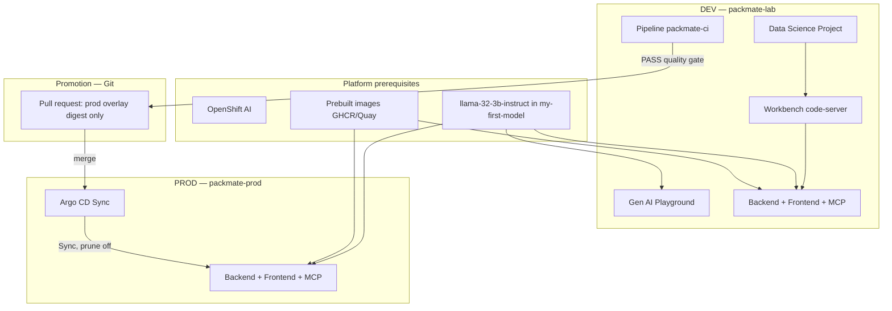

# Packmate v2

AI-powered travel packing assistant for an **OpenShift AI DEV → PROD lab** (~150 minutes): prototype in the Gen AI Playground, run it as a FastAPI + React app in **DEV** (`packmate-lab`), validate it with a Tekton Pipeline, **promote** it to **PROD** (`packmate-prod`) through a reviewed pull request, and deploy it with Argo CD.

## Release status

- Tag: **`lab-v1.0.0`**
- Images: public GHCR digests (see `docs/REPRODUCE_SANDBOX.md`)
- Quality gate: **0.9559**
- Validated PipelineRun + GitOps on OpenTLC sandbox (DEV path; see docs for the DEV/PROD split status)

## DEV → PROD narrative

1. **DEV** (`packmate-lab`): create a Data Science Project + Workbench, `make bootstrap`, prototype in the Gen AI Playground (model + system prompt + MCP), then use the same idea industrialized on the DEV Route.
2. **CI**: start Pipeline `packmate-ci` (tests → AI quality gate ≥0.90 → build backend). It only ever validates and builds in `packmate-lab` — it never deploys anywhere.
3. **Promote**: `scripts/promote-backend-image.sh --create-pr` turns a PASSing candidate digest into a pull request that touches only `deploy/overlays/prod/kustomization.yaml`. Review it, then merge.
4. **PROD** (`packmate-prod`): merging makes Argo CD Application `packmate-prod` **OutOfSync**. Sync it manually (OpenShift SSO, Prune disabled) to deploy. `packmate-prod` has no Workbench, Pipeline, Playground, or custom model endpoint — runtime only.
5. **Rollback**: `scripts/rollback-prod-image.sh --create-pr` opens a pull request restoring the previous digest — no rebuild, no direct cluster edit.

`packmate-lab` is **DEV**. It is never production. Every change that reaches `packmate-prod` goes through Git (pull request), never a direct `oc apply`.

Guides: [`docs/PARTICIPANT_GUIDE.md`](docs/PARTICIPANT_GUIDE.md) (Modules A–F) · [`docs/INSTRUCTOR_GUIDE.md`](docs/INSTRUCTOR_GUIDE.md) · [`docs/ARCHITECTURE.md`](docs/ARCHITECTURE.md) · [`docs/REPRODUCE_SANDBOX.md`](docs/REPRODUCE_SANDBOX.md) · [`docs/OPERATIONS.md`](docs/OPERATIONS.md) · [`docs/TROUBLESHOOTING.md`](docs/TROUBLESHOOTING.md) · Word assembly: [`docs/DOCX_ASSEMBLY_PLAN.md`](docs/DOCX_ASSEMBLY_PLAN.md)

## Architecture



**Playground** = model + system prompt + MCP, in DEV only.
**FastAPI app** = same idea with validation, MCP cache, bounded LLM retry, SSE streaming, metrics, NetworkPolicies — running in DEV and, once promoted, in PROD.

## Makefile

```bash
cp config/sandbox.env.example config/sandbox.env
# set digest-pinned *_IMAGE and LLM_* values from instructor
# Workbench: clone into /opt/app-root/src/packmate-agent first (never treat /opt/app-root/src as the repo)
make setup-workbench-repository   # optional safe clone/update helper
make configure-git                # optional; PACKMATE_GIT_NAME / PACKMATE_GIT_EMAIL
make preflight              # cluster + repo + image + RHOAI mirror checks
make bootstrap              # DEV workloads + resolve/render Pipeline + PROD prep
make verify / verify-dev    # DEV readiness (incl. Python digest + deps)
make verify-python-deps     # in-cluster install against the RHOAI 3.4 mirror
make resolve-pipeline-python-image  # print current openshift/python:3.12-ubi9 digest ref
make render-pipeline        # render to .generated/tekton/packmate-ci.yaml (gitignored)
make validate-pipeline      # dry-run validate rendered Pipeline
make prepare-prod           # re-run PROD prep standalone (idempotent)
make configure-argocd-rbac  # SSO group + AppProject promoter role
make verify-prod            # PROD readiness after an Argo CD Sync
make verify-gitops          # AppProject/Application/RBAC checks
make validate-prod          # static PROD overlay checks (offline)
make test                   # unit tests + quality gate + security-check
make render                 # render Kustomize DEV + PROD overlays
make promote                # scripts/promote-backend-image.sh (see --help)
make cleanup                # interactive, DEV (packmate-lab) only
```

### Portable Pipeline Python image

Do **not** commit sandbox-specific `openshift/python@sha256:…` digests. `make bootstrap` resolves `openshift/python:3.12-ubi9` on the current cluster, renders `.tekton/lab/packmate-ci.yaml.tpl` into `.generated/tekton/packmate-ci.yaml`, and applies that generated YAML. Critical Python packages (`mcp==1.27.2`, `json-repair==0.25.3`, `pydantic==2.13.1`) are pinned to versions available on the RHOAI 3.4 package mirror — participants never edit requirements or Tekton YAML by hand.

## Local development (optional)

```bash
cd backend && python -m venv .venv && source .venv/bin/activate
pip install -r requirements-dev.txt && pytest -q
cd ../frontend && npm ci && npm run test -- --run
```

## Important constraints

- Do **not** redeploy the shared Llama model, in DEV or PROD
- Do **not** commit Secrets or `config/sandbox.env`
- Do **not** use image tag `latest`
- Do **not** `oc apply -k deploy/overlays/prod` directly — Argo CD Sync only
- Do **not** push promotion/rollback branches straight to `packmate-v2` — pull request only
- GitOps / Rollouts / EvalHub are required for the PROD modules; Rollouts / EvalHub stay optional extensions

## License

See repository license file.
