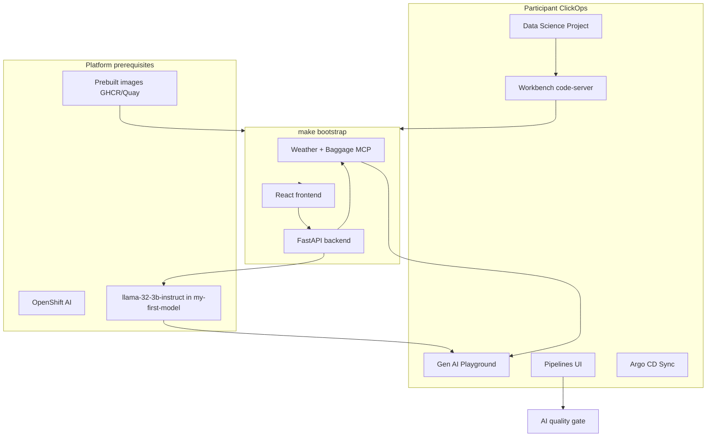

# Packmate v2

AI-powered travel packing assistant for an **OpenShift AI first-touch lab** (~120 minutes), with a short visual intro to **OpenShift Pipelines** and **Argo CD**.

## Release status

- Tag: **`lab-v1.0.0`**
- Images: public GHCR digests (see `docs/REPRODUCE_SANDBOX.md`)
- Quality gate: **0.9559**
- Validated PipelineRun + GitOps on OpenTLC sandbox (details in docs)

## Lab path (participants)

1. Create a Data Science Project (ClickOps)
2. Create a code-server Workbench (ClickOps)
3. Clone + `make preflight && make bootstrap && make verify`
4. Explore AI asset endpoints + Gen AI Playground (system prompt + MCP)
5. Export / compare with the FastAPI app
6. Use the Route UI
7. Start Pipeline `packmate-ci` (quality gate)
8. Optional: Argo CD Sync

Guides: [`docs/PARTICIPANT_GUIDE.md`](docs/PARTICIPANT_GUIDE.md) · [`docs/INSTRUCTOR_GUIDE.md`](docs/INSTRUCTOR_GUIDE.md) · [`docs/REPRODUCE_SANDBOX.md`](docs/REPRODUCE_SANDBOX.md) · Word assembly: [`docs/DOCX_ASSEMBLY_PLAN.md`](docs/DOCX_ASSEMBLY_PLAN.md)

## Architecture



**Playground** = model + system prompt + MCP.
**FastAPI app** = same idea with validation, MCP cache, bounded LLM retry, SSE streaming, metrics, NetworkPolicies.

## Makefile

```bash
cp config/sandbox.env.example config/sandbox.env
# set digest-pinned *_IMAGE values from instructor
make preflight
make bootstrap
make verify
make test
make render
make cleanup   # interactive
```

## Local development (optional)

```bash
cd backend && python -m venv .venv && source .venv/bin/activate
pip install -r requirements-dev.txt && pytest -q
cd ../frontend && npm ci && npm run test -- --run
```

## Important constraints

- Do **not** redeploy the shared Llama model
- Do **not** commit Secrets or `config/sandbox.env`
- Do **not** use image tag `latest`
- GitOps / Rollouts / EvalHub are optional extensions when Operators are missing

## License

See repository license file.
