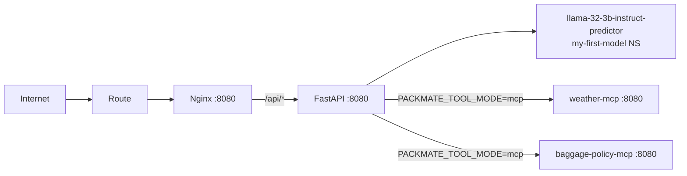

# Packmate v2 — OpenShift deployment (Kustomize)

Kustomize layout for running Packmate on OpenShift with a public Route to the frontend only. The backend is ClusterIP-only; Nginx in the frontend pod proxies `/api/` to `packmate-backend:8080`.

## Layout

```
deploy/
├── base/                    # Shared manifests (no namespace)
│   ├── backend/             # API Deployment, Service, NetworkPolicy, SA
│   ├── frontend/            # UI Deployment, Service, Route, NetworkPolicy, SA
│   ├── mcp-weather/         # weather-mcp Deployment, Service, Route, NetworkPolicy, SA
│   ├── mcp-baggage/         # baggage-policy-mcp Deployment, Service, Route, NetworkPolicy, SA
│   ├── configmap.yaml       # packmate-config (BASE_URL, MODEL, OTEL, tool mode)
│   └── kustomization.yaml
├── workbench/               # DSP + code-server Workbench docs (UI-first; YAML example only)
├── examples/
│   └── mcp-registration/    # Gen AI Playground MCP registration example (not applied by default)
├── overlays/
│   ├── dev/                 # namespace packmate-dev, 1 replica each
│   └── prod/                # namespace packmate-prod, 2 replicas + PDBs
└── components/
    └── oauth-proxy/         # Optional OAuth gate (disabled by default)
```

## Architecture



| Resource | Access |
|----------|--------|
| `Route/packmate-frontend` | Public (TLS edge) |
| `Service/packmate-frontend` | ClusterIP |
| `Service/packmate-backend` | ClusterIP only — no Route |
| `Route/weather-mcp`, `Route/baggage-policy-mcp` | Public MCP endpoints (Playground registration) |
| `Service/weather-mcp`, `Service/baggage-policy-mcp` | ClusterIP — backend uses in-namespace URLs |

### MCP tool mode

The backend resolves tools in two modes (see `backend/app/tools/settings.py`):

| Mode | Config | Behavior |
|------|--------|----------|
| `local` | `PACKMATE_TOOL_MODE=local` | In-process Python tools (Workbench, unit tests) |
| `mcp` | `PACKMATE_TOOL_MODE=mcp` | Streamable HTTP calls to `weather-mcp` and `baggage-policy-mcp` |

OpenShift overlays set **`PACKMATE_TOOL_MODE=mcp`** in `packmate-config` with in-cluster URLs:

- `PACKMATE_WEATHER_MCP_URL`: `http://weather-mcp:8080/mcp`
- `PACKMATE_BAGGAGE_MCP_URL`: `http://baggage-policy-mcp:8080/mcp`

MCP server source and tests: [`mcp-servers/`](../mcp-servers/). Playground registration example: [`examples/mcp-registration/`](examples/mcp-registration/).

### LLM model (external to this repo)

Inference runs in the **`my-first-model`** namespace (not managed here). The backend reaches it via:

```
http://llama-32-3b-instruct-predictor.my-first-model.svc.cluster.local:8080/v1
```

Configured in `packmate-config` ConfigMap (`BASE_URL`, `MODEL`).

## Prerequisites

1. OpenShift cluster with Kustomize (built into `oc`) or standalone `kustomize`.
2. Target namespaces: `packmate-dev`, `packmate-prod`.
3. LLM API key secret (**not in git**):

```bash
oc create namespace packmate-dev
oc create secret generic packmate-llm \
  --from-literal=LITELLM_API_KEY='<your-key>' \
  -n packmate-dev
```

Repeat for `packmate-prod` when promoting.

## Render & validate

```bash
./scripts/render-manifests.sh          # writes deploy/rendered/{dev,prod}.yaml
./scripts/validate-manifests.sh        # schema-check rendered output
```

Preview without writing files:

```bash
kustomize build deploy/overlays/dev
kustomize build deploy/overlays/prod
```

## Apply (manual)

**Do not apply from CI without review.** Example:

```bash
oc apply -k deploy/overlays/dev
oc get route packmate-frontend -n packmate-dev
```

## Images

Base manifests use placeholder tags (`PLACEHOLDER`). Overlays replace them via the `images` field — **never use `:latest`**.

| Image | Base reference |
|-------|----------------|
| Backend | `quay.io/example/packmate-backend:PLACEHOLDER` |
| Frontend | `quay.io/example/packmate-frontend:PLACEHOLDER` |
| weather-mcp | `quay.io/example/packmate-weather-mcp:PLACEHOLDER` |
| baggage-policy-mcp | `quay.io/example/packmate-baggage-policy-mcp:PLACEHOLDER` |

| Overlay | Tag example |
|---------|-------------|
| dev | `sha-dev` |
| prod | `sha-prod` (replace with CI tag) |

### Production digest pinning

Prefer immutable references in `overlays/prod/kustomization.yaml`:

```yaml
images:
  - name: quay.io/example/packmate-backend
    newName: quay.io/example/packmate-backend
    digest: sha256:0123456789abcdef...
  - name: quay.io/example/packmate-frontend
    newName: quay.io/example/packmate-frontend
    digest: sha256:fedcba9876543210...
```

Or use content-addressed tags such as `sha-a1b2c3d4` from your pipeline.

## Security

- Pod `securityContext`: `runAsNonRoot`, `seccompProfile: RuntimeDefault`
- Container: `allowPrivilegeEscalation: false`, drop all capabilities, `readOnlyRootFilesystem: true`
- Writable `/tmp` via `emptyDir` where needed (backend Python, frontend Nginx)
- NetworkPolicies: frontend ingress from OpenShift ingress; frontend → backend; backend → DNS + `my-first-model:8080` + in-namespace MCP pods; MCP Routes for external Playground access
- Secrets referenced only by name (`packmate-llm` / key `LITELLM_API_KEY`)

## Probes

| Workload | Liveness | Readiness |
|----------|----------|-----------|
| backend | `GET /health` | `GET /ready` |
| frontend | `GET /` | `GET /` |

> **Note:** Ensure the backend exposes `/ready` (returns 200 when the process can serve traffic). `/health` is already implemented.

## Optional OAuth proxy

See [`components/oauth-proxy/README.md`](components/oauth-proxy/README.md). Uncomment `components:` in an overlay to enable.

## Workbench (lab development)

See [`workbench/README.md`](workbench/README.md) for creating the `packmate-lab` Data Science Project and code-server Workbench via the OpenShift AI UI (YAML is example-only).

## Environment summary

| Variable | Source |
|----------|--------|
| `BASE_URL`, `MODEL`, OTEL vars, `PACKMATE_TOOL_MODE`, MCP URLs | ConfigMap `packmate-config` |
| `LITELLM_API_KEY` | Secret `packmate-llm` (key `LITELLM_API_KEY`) |
