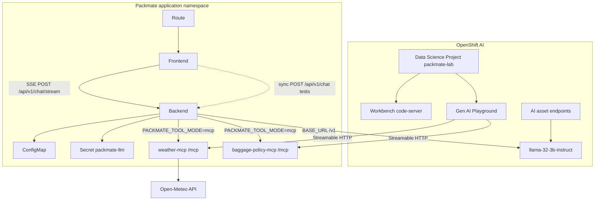
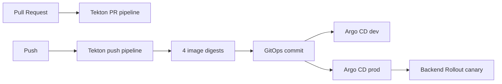

# Architecture

## Lab pedagogy (120 minutes)

| Layer | Examples |
|-------|----------|
| Participant ClickOps | Data Science Project, Workbench, AI asset endpoints, Playground, Pipeline Start, Argo Sync |
| `make bootstrap` | MCP servers, FastAPI, frontend, Secrets, Routes, MCP registration, Tekton/Argo manifests |
| Platform prerequisites | OpenShift AI, Pipelines, optional GitOps, shared Llama in `my-first-model`, prebuilt images |

Playground = **model + system prompt + MCP**.
FastAPI Packmate = Playground idea **industrialized** (Pydantic validation, MCP cache, bounded LLM retry, SSE + heartbeats, metrics, NetworkPolicies).

## Runtime components (OpenShift AI–centered)

## Tool modes

| Mode | When | Weather / baggage | Traveler profile |
|------|------|-------------------|------------------|
| `local` (default for tests) | Unit tests, laptop/Workbench without MCP pods | In-process Python | Always local |
| `mcp` (OpenShift ConfigMap default) | Cluster deploy | Streamable HTTP MCP servers | Always local (never shared MCP) |

## Agent loop

1. Receive chat request + optional traveler profile (sanitized for LLM)
2. Call tools: `get_weather`, `baggage_rules` (maps to MCP tools in mcp mode), `traveler_profile` (local only)
3. Ask model for structured PackingResponse JSON
4. Parse + validate with Pydantic
5. Deterministically enrich baggage warnings, privacy filters, daily forecast, category order
6. Return response

## Chat transport (sync vs streaming)

| Endpoint | Used by | Purpose |
|----------|---------|---------|
| `POST /api/v1/chat` | Tests, evals, in-cluster scripts | Single JSON response (`PackingResponse`) |
| `POST /api/v1/chat/stream` | Public React UI | SSE with `started` / `progress` / `heartbeat` / `completed` / `error` |

On AWS Classic ELB sandboxes the **idle** timeout is ~60s (no bytes on the wire). That is different from the Route/Nginx **total** timeout (180s). Streaming sends heartbeats at least every 10s so long agent runs stay alive without raising the ELB idle setting.

SSE never streams: model chain-of-thought, `<think>` tags, medical notes, raw tool payloads, stack traces, or credentials.

## OpenShift AI lab path

1. Data Science Project + Workbench
2. Discover model in AI asset endpoints
3. Deploy/register MCP servers (`gen-ai-aa-mcp-servers` ConfigMap — admin)
4. Prototype in Gen AI Playground → export
5. Integrate into FastAPI + React
6. Level 1 deterministic evals (+ optional TrustyAI/EvalHub)
7. Tekton (4 images) → GitOps → Argo CD → Rollouts canary (backend)

## Delivery

MCP servers version via Deployment image digests (not Rollouts by default).

## Privacy boundaries

- Medical / accessibility notes stay in-app; never sent to MCP servers
- Logs and OTel spans never include message bodies or notes
- Baggage rules always include the demonstration disclaimer

## Observability

- `/metrics` Prometheus exposition
- Optional OTLP traces (including `mcp.call_tool` spans)
- `/health` and `/ready` on app and MCP servers
