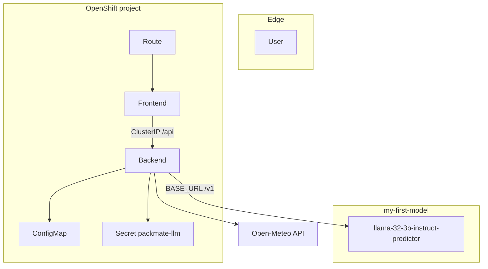
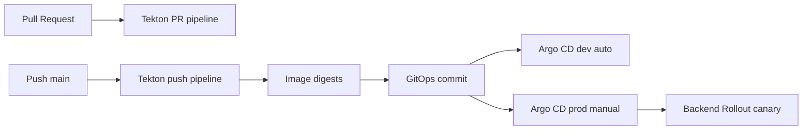

# Architecture

## Runtime components

## Agent loop

1. Receive chat request + optional traveler profile
2. Call tools as needed: weather, baggage_rules, traveler_profile
3. Ask model for structured PackingResponse JSON
4. Parse + validate with Pydantic
5. Deterministically enrich baggage warnings, privacy filters, daily forecast, category order
6. Return response

## Delivery

## Privacy boundaries

- Medical notes stay local unless explicit consent flag is true
- Logs and OTel spans never include message bodies or notes
- Frontend does not persist sensitive fields

## Observability

- `/metrics` Prometheus exposition
- Optional OTLP traces
- `/health` liveness, `/ready` readiness (no LLM dependency)
